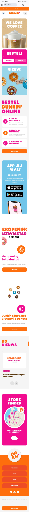
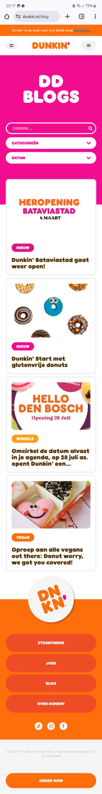
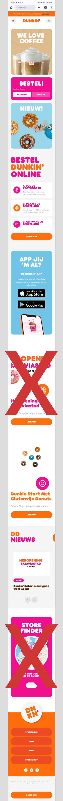
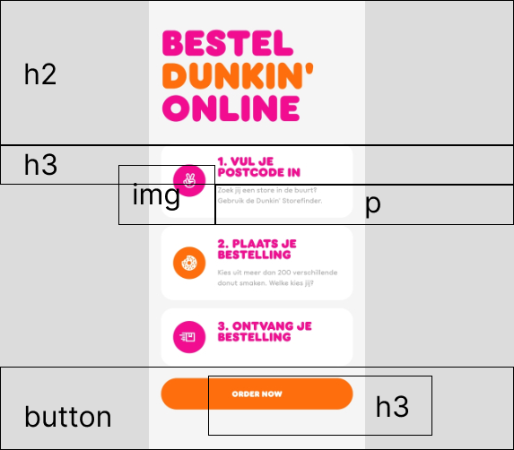
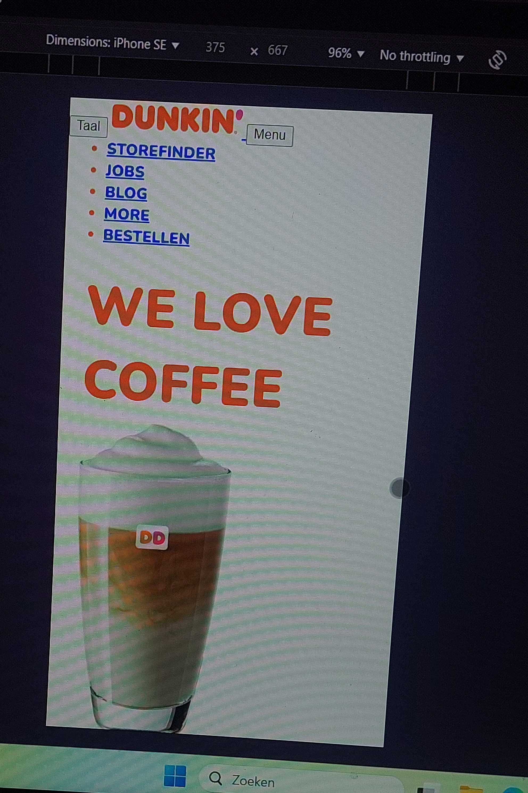
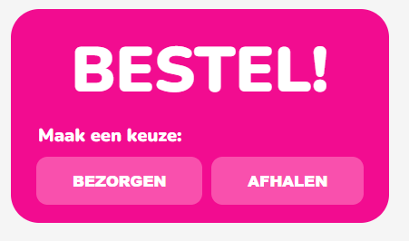
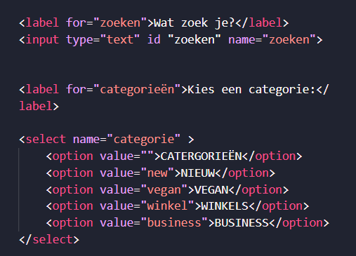
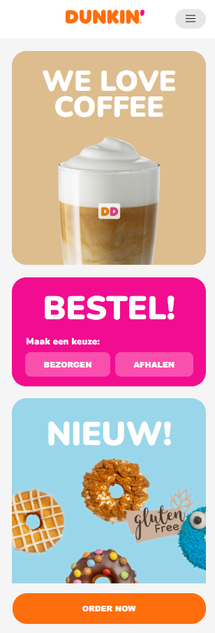

# Procesverslag
Markdown is een simpele manier om HTML te schrijven.  
Markdown cheat cheet: [Hulp bij het schrijven van Markdown](https://github.com/adam-p/markdown-here/wiki/Markdown-Cheatsheet).

Nb. De standaardstructuur en de spartaanse opmaak van de README.md zijn helemaal prima. Het gaat om de inhoud van je procesverslag. Besteedt de tijd voor pracht en praal aan je website.

Nb. Door *open* toe te voegen aan een *details* element kun je deze standaard open zetten. Fijn om dat steeds voor de relevante stuk(ken) te doen.

## Jij

  
uitwerken voor kick-off werkgroep

  ### Auteur:
  Kelly Kha

  #### Je startniveau:
  Blauw/Rood

  #### Je focus:
  Surface
 

## Je website

  
uitwerken voor kick-off werkgroep

  ### Je opdracht:
  https://www.dunkin.nl/ 

  #### Screenshot(s) van de eerste pagina (small screen): 
  hier de naam van de pagina  
  

  #### Screenshot(s) van de tweede pagina (small screen):
  hier de naam van de pagina  
  
 

## Toegankelijkheidstest 1/2 (week 1)

  
uitwerken na test in 2e werkgroep

  ### Bevindingen
  Lijst met je bevindingen die in de test naar voren kwamen:
  - Ze maken geen gebruik van li's 
  - Ze maken geen gebruik van buttons
  - Ze gebruiken geen alt
  - Ze gebruiken geen h2's alleen maar h1
  - Bij koppelingen zeggen ze soms alleen maar koppeling, maar niet waarnaartoe

## Breakdownschets (week 1)

  
uitwerken na afloop 3e werkgroep

  ### de hele pagina: 
  

  ### dynamisch deel (bijv menu): 
  

  ### wellicht nog een dynamisch deel (bijv filter): 
  

## Voortgang 1 (week 2)

  
uitwerken voor 1e voortgang

  ### Stand van zaken
  hier dit ging goed & dit was lastig (neem ook screenshots op van delen van je website en code)
  
  Ik had nog alleen maar mijn html, maar opzich ging dat wel goed. Ik had alleen een vraag over hoe het werkt met de bewegende images

  

  ### Verslag van meeting
  hier na afloop snel de uitkomsten van de meeting vastleggen

  - Het is beter om op click te doen voor deze opdracht in plaats van on load, volgens de student assistent is on load te veel werk voor de tijd die we hebben

## Voortgang 2 (week 3)

  
uitwerken voor 2e voortgang

  ### Stand van zaken
  hier dit ging goed & dit was lastig (neem ook screenshots op van delen van je website en code)

  Voor deze week liep ik vast bij het maken van de animaties bij mijn button, want ik wilde dat er "hapjes" in kwamen. Ook liep ik vast bij hoe het zat met transition delays voor mijn menu.

  En als laatste lukte het me niet om mijn footer fixed te hebben aan de onderkant. 

  

  ### Verslag van meeting
  hier na afloop snel de uitkomsten van de meeting vastleggen

  - :before & :after voor de knop animatie gebruiken voor de hapjes
  - Omdat ik me focus op de surface plane kan ik mijn body gewoon een max-width geven zodat het zonder het op inspecteren mode er ook goed uitziet
  - transition delay gebruiken voor de li's in mijn navigatie zodat ze een voor een tervoorschijn komen
  - footer op fixed zetten ipv sticky
  - als je twee verschillende elementen hebt moet je ze apart oproepen in de css zelfs als ze dezelfde animatie hebben

## Toegankelijkheidstest 2/2 (week 4)

  
uitwerken na test in 9e werkgroep

  ### Bevindingen
  Lijst met je bevindingen die in de test naar voren kwamen (geef ook aan wat er verbeterd is):

  - Ik was dus vergeten dat er maar 1 keer een h1 per pagina kon, dus dat moet ik nog aanpassen
  - Verder heb ik wel gebruik gemaakt van li's en buttons
  - Ook had ik al null alts en gebruikte alts waar het nodig is

## Voortgang 3 (week 4)

  
uitwerken voor 3e voortgang

  ### Stand van zaken
  hier dit ging goed & dit was lastig (neem ook screenshots op van delen van je website en code)

  Ik heb nog moeite met het gebruik van aria's. Ik wist niet helemaal zeker waar je ze moest gebruiken en ook hoe labels in elkaar zitten. Verder in mijn screenreader leest het alle menu items ook voor zonder dat het menu opent.

  

  ### Verslag van meeting
  hier na afloop snel de uitkomsten van de meeting vastleggen

  - focus within als dat niet werkt dan in js zetten dat het het moet negeren of menu openen
  - aria labels voor elke interactief element gebruiken
  - label en input gebruik je for en id om ze te connecten

## Eindgesprek (week 5)

  
uitwerken voor eindgesprek

  ### Je uitkomst - karakteristiek screenshots:
  

  ### Dit ging goed/Heb ik geleerd: 
  Ik ben echt trots op hoe de laadscherm is gelukt. Dit heb ik met animatie gedaan in css. Hierdoor heb ik echt veel geleerd over hoe animaties werken, maar ook hoe je elke individuele letter kan animeren met behulp van

  

  ### Dit was lastig/Is niet gelukt:
  Een van de dingen die mij niet gelukt was, was dat als de screenreader het voorleest dat het de items in de menu niet voorleest/wel voorleest en het menu opent. Ik heb focus within geprobeerd, maar ik snapte het niet zo heel goed waardoor het niet is gelukt. 

  

## Bronnenlijst

  
continu bijhouden terwijl je werkt

  Nb. Wees specifiek ('css-tricks' als bron is bijv. niet specifiek genoeg). 
  Nb. ChatGpT en andere AI horen er ook bij.
  Nb. Vermeld de bronnen ook in je code.

  1. https://css-tricks.com/html-inputs-and-labels-a-love-story/
  2. bron 2
  3. ...

